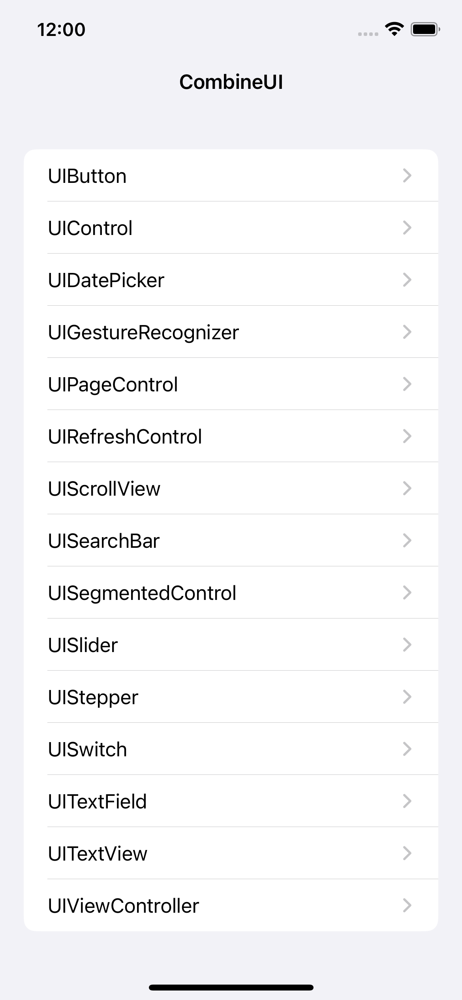

# CombineUI Example Project



## Project Setup

### Install Dependencies

```
brew install xcodegen
```

### Generate Xcode Project

```
xcodegen
```

Execute the `xcodegen` command any time the `project.yml` file is changed or project files are added or removed. See the [xcodegen](https://github.com/yonaskolb/XcodeGen) documentation for more information.
